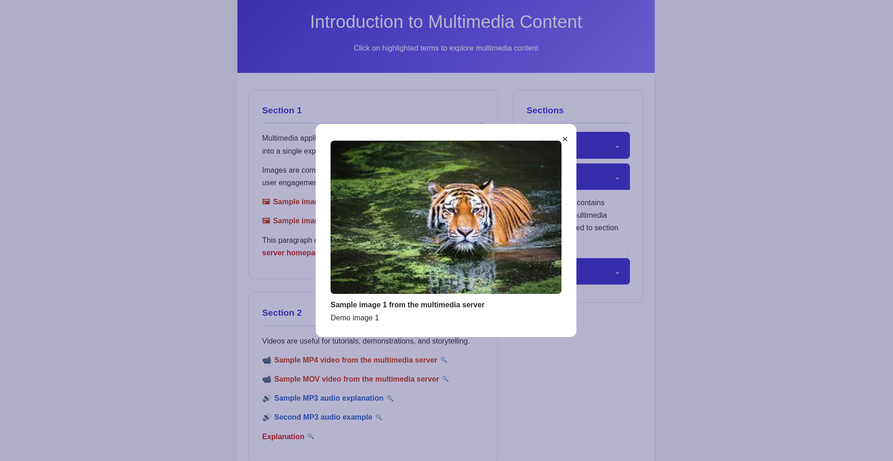

# Multimedia Content Writer

A demonstration multimedia teaching platform where writers can create rich educational content and readers can consume it seamlessly. The system supports text, images, audio, video, and external links within a structured content format.

## Overview

This project is designed as a full-stack multimedia content delivery system with a structured pipeline:

* Writers create content in a structured XML format (manual for now, editor not yet implemented)
* Backend parses XML into HTML and extracts multimedia assets
* Media files and structured content are stored in MongoDB Atlas
* Frontend fetches and renders processed content for readers

This architecture enables flexible, media-rich educational content delivery while maintaining a clean separation between authoring, processing, and presentation layers.

## Live Demo

- Frontend (Vercel): [https://multimedia-content-writter.vercel.app/](https://multimedia-content-writter.vercel.app/)
- Backend (Render): [https://multimedia-app-4cw7.onrender.com/](https://multimedia-app-4cw7.onrender.com/)

## Screenshot

Application preview:



## Features

### Content Creation (Writer Side)

* Structured XML-based content format
* Support for:

  * Text content
  * Images
  * Audio
  * Video
  * External links
* Manual XML writing (editor UI not implemented yet)

### Content Processing (Backend)

* XML parsing into structured data
* Conversion into HTML for frontend rendering
* Media extraction and storage
* MongoDB Atlas integration for persistent storage

### Content Consumption (Reader Side)

* Rendered multimedia articles
* Supports mixed media layout (text + media integration)
* Dynamic content fetched from backend API

## Architecture

```
Writer (XML Input)
        ↓
Backend API (FastAPI / Node / etc.)
        ↓
XML Parser → HTML Converter
        ↓
MongoDB Atlas (Content + Metadata)
        ↓
Frontend (Next.js / React)
        ↓
Reader Experience (Multimedia Rendering)
```

## Tech Stack

### Frontend

* Next.js
* React
* Tailwind CSS

### Backend

* FastAPI
* XML Parser
* HTML rendering engine

### Database

* MongoDB Atlas

### Deployment

* Frontend: Vercel
* Backend: Render

## Data Flow

1. Writer submits XML content
2. Backend validates and parses XML
3. Multimedia assets are extracted and stored
4. HTML version is generated for rendering
5. Content is saved in MongoDB with metadata
6. Frontend fetches processed content via API
7. Reader views formatted multimedia content

## Example XML Structure

```xml
<article>
  <title>Sample Lesson</title>

  <text>
    This is a sample educational paragraph explaining a concept.
  </text>

  <image src="https://example.com/image.jpg" />

  <audio src="https://example.com/audio.mp3" />

  <video src="https://example.com/video.mp4" />

  <link href="https://example.com">
    External Resource
  </link>
</article>
```

## Current Limitation

* No visual XML editor yet (manual XML writing required)
* Basic content validation only
* Limited styling control for rendered HTML

## Future Improvements

* Rich text / WYSIWYG editor for writers
* Drag-and-drop multimedia builder
* Real-time preview system
* Role-based authentication (writer/reader/admin)
* Version control for articles
* Improved XML schema validation
* Better media optimization pipeline


